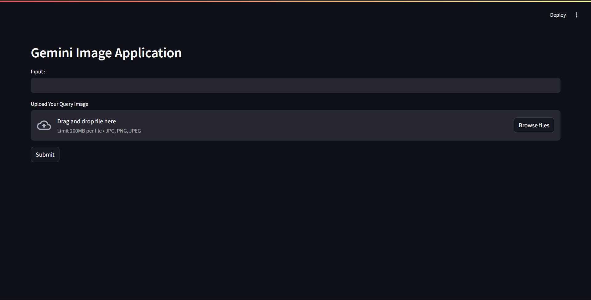
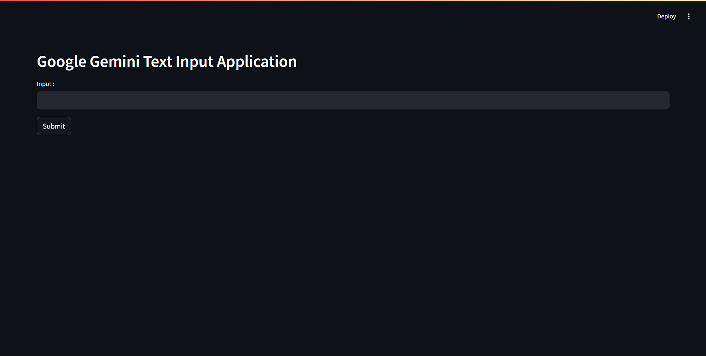
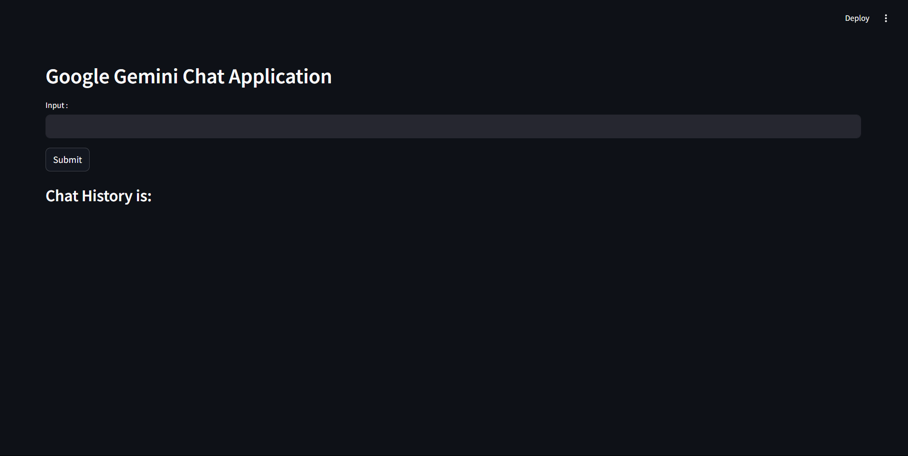
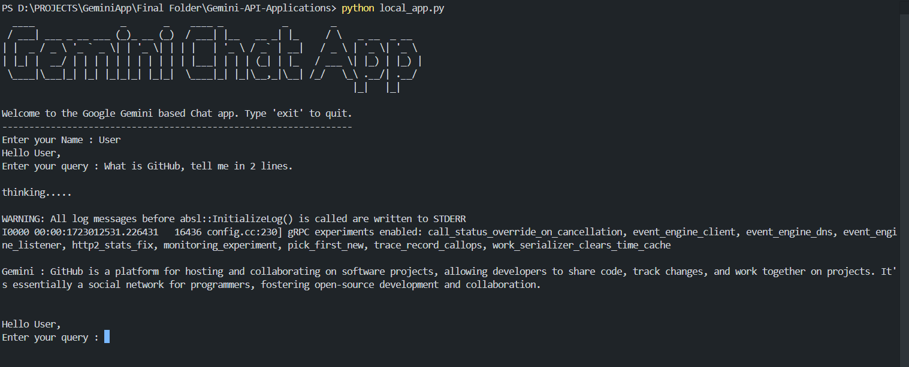

---

# Gemini API Application

---

This project utilizes the Gemini API to query generative AI models based on image and text inputs, producing text outputs. The application is built using Python and offers a straightforward interface for interacting with the Gemini API, along with a Streamlit-based frontend.

## Features

- **Image and Text Inputs**: Accepts both image and text inputs for querying the Gemini API.
- **Text Output**: Generates and retrieves text-based responses from the AI model.
- **Streamlit Interface**: Provides an easy-to-use web interface for interaction with the application.
- **Modular Design**: Easily extendable for different use cases or additional functionalities.

## Screenshots

1. Streamlit App for Visual/Image Input ( vision_app.py )


2. Streamlit App for Text Input ( single_query_app.py )


3. Streamlit App for Question and Answer Chat ( qna_chat_app.py )


4. CLI App for Local Running ( local_app.py )


## Requirements/Prerequisites

- Python 3
- Gemini API Key
- Streamlit

## Installation

1. **Clone the Repository**:
   ```bash
   git clone https://github.com/yourusername/gemini-api-generative-query.git
   cd gemini-api-generative-query
   ```

2. **Install Dependencies**:
   ```bash
   pip install -r requirements.txt
   ```

3. **Set Up Environment Variables**:
   Create a `.env` file in the root directory and add your Gemini API key:
   ```bash
   GEMINI_API_KEY=your_api_key_here
   ```

## Usage

1. 

### Running the Streamlit Application

1. **Start the Streamlit App**:
   ```bash
   streamlit run app.py
   ```

2. **Access the Web Interface**:
   Open your browser and go to `http://localhost:8501` to use the application.

3. **Input Your Query**:
   - You can input an image by uploading it or text directly into the provided fields.
   - The application will process the input and generate a text response.

## Project Structure

```
gemini-api-generative-query/
│
├── app.py              # Main Streamlit application file
├── gemini_client.py    # Handles communication with the Gemini API
├── utils.py            # Utility functions for image and text processing
├── requirements.txt    # Python dependencies
└── README.md           # Project documentation
```

## Contributing

Contributions are welcome! Please submit a pull request or open an issue for any features, bugs, or suggestions.

## Thank You.. :)
---